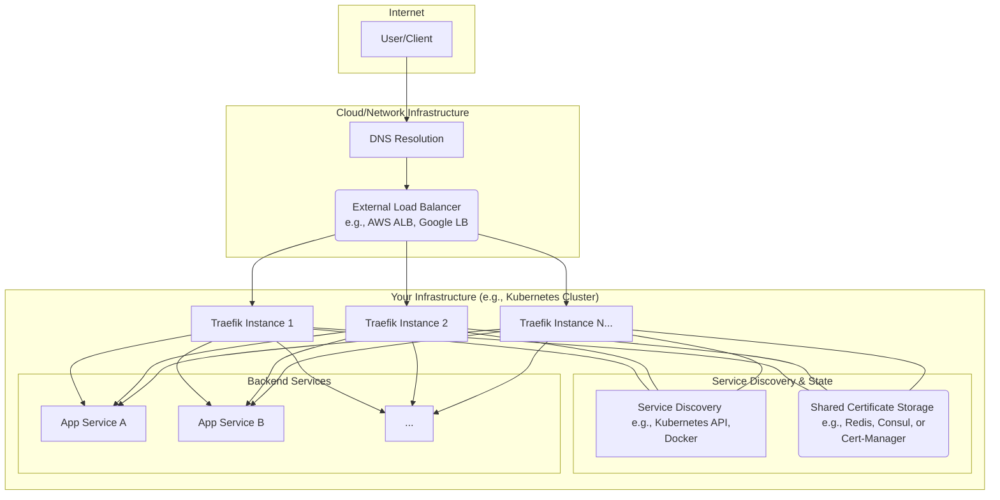

<p align="center">
      <source media="(prefers-color-scheme: dark)" srcset="resources/docker-logo-blue.png">
      
      <source media="(prefers-color-scheme: dark)" srcset="resources/traefik.logo.png">
      
</p>

# Traefik Load Balancer with Docker Compose

This project demonstrates how to use Traefik as a reverse proxy and load balancer for a simple web application using Docker Compose.

## Getting Started

These instructions will get you a copy of the project up and running on your local machine for development and testing purposes.

### Prerequisites

*   [Docker](https://docs.docker.com/get-docker/)
*   [Docker Compose](https://docs.docker.com/compose/install/)

### Installation

1.  Clone the repository:
    ```bash
    git clone <repository-url>
    ```
2.  Navigate to the project directory:
    ```bash
    cd docker-compose-traefik
    ```

## Usage

To start the services, run the following command:

```bash
docker-compose up -d
```

This will start Traefik and a single instance of the web application.

### Horizontal Scaling

To scale the web application to multiple instances (e.g., 100), run the following command:

```bash
docker-compose up -d --scale webapp=100
```

This will create 100 instances of the web application, and Traefik will automatically load balance the traffic between them.

Here is a diagram illustrating how Traefik handles horizontal scaling:



## Testing the Load Balancer

To test the load balancer, you can send multiple requests to `http://app.localhost/`. You can use a tool like `curl` in a loop to do this.

**Using PowerShell:**
```powershell
for ($i=1; $i -le 100; $i++) { Invoke-WebRequest -Uri http://app.localhost/ -UseBasicParsing }
```

**Using bash:**
```bash
for i in {1..100}; do curl http://app.localhost/; done
```

Each request should be served by a different instance of the web application, which you can verify by looking at the `Hostname` in the response.

## Traefik Dashboard

You can access the Traefik dashboard to monitor the services and routing rules at `http://localhost:8080`.
